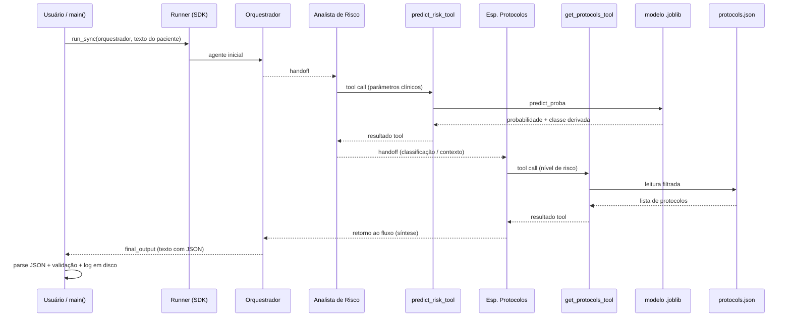

# Arquitetura do Sistema Multiagente — CardioIA Fase 6

**Projeto:** CardioIA — Fase 6 (Sistema preditivo multiagente)  
**FIAP — 2TIAOR20242**  
**Data:** 2026-04-21  

**Equipe:** Alexandre Mantovani · Edmar Souza · Ricardo Coube · Jose Andre Filho  

---

## Documentos relacionados

| Arquivo | Uso |
|---------|-----|
| **Este arquivo** (`arquitetura_multiagente.md`) | Documentação **completa** em Markdown: requisitos da disciplina, desenho técnico, rastreabilidade código ↔ enunciado, exemplos reproduzíveis. |
| [`arquitetura_multiagente_fiap_pdf.md`](arquitetura_multiagente_fiap_pdf.md) | Versão **enxuta** (diagrama, papéis, handoffs/tools, exemplo E/S) otimizada para exportar **PDF de até 3 páginas**, conforme enunciado da Parte 2. |

---

## Encaixe com a solução das fases 1 a 5

O **CardioIA** entregue até à Fase 5 permanece o núcleo conversacional do produto: a aplicação Flask criada em `backend/app.py` regista o blueprint de `backend/routes/chat_routes.py`, expondo **`POST /api/chat`** e **`GET /health`** para o `frontend/` estático. O mesmo `app.py` regista **`backend/routes/prediction_routes.py`**, expondo **`POST /api/predict-risk`**, que importa `run_pipeline` / `run_pipeline_ml_only` / `validate_patient_data` de `agents.pipeline` (mesmo modelo `.joblib` e mesma base `protocols.json`). A integração opcional com IBM Watson Assistant (`backend/services/watson_service.py`) e o **bloqueio de urgência** em `backend/utils/safety_rules.py` aplicam-se ao chat **e** ao campo opcional `context_message` da predição HTTP.

A **Fase 6** acrescenta, no **mesmo repositório**: (1) o artefato de ML `ml/modelo_risco_cardiaco.joblib` (Parte 1); (2) o pacote `agents/` com **`agents/personas/`** (um módulo por agente), **`agents/pipeline/`** (validação, recomendação, persistência, `run_pipeline`), `agents/main.py` (CLI `python -m agents.main`) e **`agents/batch_process.py`** (lote IR ALÉM 2); (3) **`agents/governance/`** — verificação de **coerência** entre `risk_classification` e `risk_level` dos protocolos, exposta em cada recomendação como `governance` e persistida nos logs JSON. O OpenAI Agents SDK continua a ser a camada de orquestração LLM quando `mode=agents` e `OPENAI_API_KEY` estão disponíveis.

O **`GET /health`** inclui o objeto **`fase6_prediction`** (prontidão do ficheiro do modelo, protocolos, pacote `openai-agents`, chave OpenAI) calculado em `backend/utils/prediction_readiness.py`.

Em resumo: **um único produto académico** — interface web + APIs (chat + predição + health) e **extensão** preditiva multiagente, documentada de forma unificada no `README.md` e no [`glossario_unificado_cardioia.md`](glossario_unificado_cardioia.md) (contrato `unified-demo-flow.md` v1.1).

---

## 0. Conformidade com o enunciado (Parte 2)

O enunciado da Fase 6 exige um sistema multiagente com **OpenAI Agents SDK**, contendo **no mínimo** três papéis: **Analista de Risco**, **Especialista em Protocolos** e **Orquestrador**; fluxo com **handoffs**, **tools**, **histórico de mensagens** e **validação de saída**; resposta final com **probabilidade**, **classificação de risco** e **protocolos sugeridos**.

| Requisito do enunciado | Evidência no repositório |
|------------------------|-------------------------|
| Agente que consulta o modelo preditivo | `Agent` **Analista de Risco** + `predict_risk_tool` em `agents/tools/risk_predictor.py` |
| Agente que consulta protocolos simulados | `Agent` **Especialista em Protocolos** + `get_protocols_tool` em `agents/tools/protocol_database.py` |
| Orquestrador com handoffs | `Agent` **Orquestrador** + `handoff(analista_risco)` em `agents/personas/orchestrator_agent.py` |
| Dados de novo paciente | `run_pipeline(patient_data)` + `validate_patient_data` em `agents/pipeline/patient.py` |
| Probabilidade + classificação + protocolos | Campos `probability`, `risk_classification`, `suggested_protocols` na recomendação final |
| Handoffs entre agentes | `handoff()` encadeando Orquestrador → Analista → Especialista (e retorno ao fluxo do Runner) |
| Uso de tools | `@function_tool` nas duas tools citadas |
| Histórico de mensagens | Construído pelo **Runner** do SDK na execução síncrona; complementado por log JSON em disco |
| Validação de saída | `_validate_output` em `agents/pipeline/recommendation.py` |
| Integração com modelo treinado | `ml/modelo_risco_cardiaco.joblib` carregado via `joblib` dentro de `predict_risk` |
| Governança / coerência (IR ALÉM 1) | `agents/governance/coherence.py` → campo `governance` na recomendação e no log |
| Integração HTTP (produto único) | `POST /api/predict-risk` em `backend/routes/prediction_routes.py` |
| Lote simulado (IR ALÉM 2) | `python -m agents.batch_process` → `agents/logs/batch_last_summary.json` |

---

## 1. Visão geral

O sistema da Parte 2 **não substitui** decisão médica: é um **protótipo acadêmico** que combina (1) um **classificador binário** treinado na Parte 1 para a variável **`pico_risco`** (0 = sem pico, 1 = pico), com (2) uma **camada multiagente** que usa um LLM para orquestrar chamadas a funções determinísticas (modelo + JSON de protocolos), produzindo uma **recomendação estruturada** e rastreável.

**Fluxo lógico em uma frase:** o Orquestrador recebe a descrição do paciente → delega ao Analista, que materializa números na tool de ML → o Especialista consulta protocolos coerentes com a faixa de risco → o fluxo retorna ao Orquestrador para entregar JSON final validado e impresso no terminal, com cópia em arquivo.

---

## 2. Diagramas da arquitetura

### 2.1 Diagrama em blocos (ASCII)

```
┌──────────────────────────────────────────────────────────────────────────┐
│ ENTRADA                                                                   │
│ dict / JSON: idade, freq_cardiaca, spo2, carga_sistema,                   │
│              disponibilidade_recursos                                     │
│ Validação: intervalos em agents/pipeline/patient.py (PATIENT_FIELD_RANGES) │
└───────────────────────────────────┬──────────────────────────────────────┘
                                    │
                                    ▼
┌──────────────────────────────────────────────────────────────────────────┐
│ AGENTE: Orquestrador (OpenAI Agents SDK)                                  │
│ Instruções: delegar análise; exigir JSON final com disclaimer            │
│ Tools: nenhuma                                                            │
│ Handoff: → Analista de Risco                                              │
└───────────────────────────────────┬──────────────────────────────────────┘
                                    │ handoff
                                    ▼
┌──────────────────────────────────────────────────────────────────────────┐
│ AGENTE: Analista de Risco                                                 │
│ Tools: predict_risk_tool → predict_risk()                                   │
│   • Features na mesma ordem do notebook Parte 1                           │
│   • predict_proba(X)[0][1] = P(pico_risco=1)                              │
│   • Limiares em agents/config.py: <0,3 baixo; <0,7 médio; senão alto       │
│ Handoff: → Especialista em Protocolos                                     │
└───────────────────────────────────┬──────────────────────────────────────┘
                                    │ handoff
                                    ▼
┌──────────────────────────────────────────────────────────────────────────┐
│ AGENTE: Especialista em Protocolos                                        │
│ Tools: get_protocols_tool → get_protocols(risk_classification)            │
│   • Fonte: agents/data/protocols.json                                     │
│ Handoff: de volta ao contexto do Runner para síntese pelo Orquestrador   │
└───────────────────────────────────┬──────────────────────────────────────┘
                                    │
                                    ▼
┌──────────────────────────────────────────────────────────────────────────┐
│ SAÍDA                                                                      │
│ • Estrutura: probability, risk_classification, suggested_protocols,      │
│              disclaimer, governance (coerência)                           │
│ • Validação programática: _validate_output                                │
│ • Persistência: agents/logs/<timestamp>_<id>_execution.json               │
│ • Apresentação: _print_result em stdout                                   │
└──────────────────────────────────────────────────────────────────────────┘
```

### 2.2 Diagrama de sequência (Mermaid)



---

## 3. Papel de cada agente (detalhado)

### 3.1 Orquestrador

- **Arquivo:** `agents/personas/orchestrator_agent.py` (`build_orchestrator_agent`).
- **Função:** ponto de entrada lógico do **multiagente** na execução com `Runner.run_sync(orquestrador, input_text)`.
- **Contrato de saída:** instruções fixam JSON com chaves `probability`, `risk_classification`, `suggested_protocols`, `disclaimer`, alinhado ao enunciado.
- **Disclaimer:** constante `DISCLAIMER` em `agents/config.py`, reforçando uso acadêmico e SAMU 192.
- **Por que sem tools:** separação de responsabilidades — o Orquestrador **coordena**; as evidências numéricas vêm da tool de ML e as ações clínicas simuladas da tool de protocolos.

### 3.2 Analista de Risco

- **Arquivo:** `agents/personas/risk_analyst_agent.py` + tool em `agents/tools/risk_predictor.py`.
- **Função:** única fonte da **probabilidade de pico** e da **classificação** derivada por limiares.
- **Alinhamento Parte 1 ↔ Parte 2:** o notebook gera o target **`pico_risco`** binário; o modelo persiste em `ml/modelo_risco_cardiaco.joblib`; na Parte 2 usa-se **probabilidade da classe positiva** (índice 1 de `predict_proba`), coerente com classificação binária vista em aula.
- **Handoff:** após cumprir o papel de risco, transfere ao Especialista para anexar protocolos.

### 3.3 Especialista em Protocolos

- **Arquivo:** `agents/personas/protocol_specialist_agent.py` + `agents/tools/protocol_database.py` + `agents/data/protocols.json`.
- **Função:** traduz `baixo` / `médio` / `alto` em **listas de protocolos simulados** (identificador, nome, lista de ações).
- **Comportamento robusto:** nível inválido resulta em lista vazia e log de aviso, sem exceção fatal (coberto por testes em `agents/tests/`).

---

## 4. Handoffs e tools (mecanismo técnico)

### 4.1 Handoffs

No SDK utilizado, `handoff(agente_destino)` registra que o **controle** pode passar para outro `Agent`, compartilhando o **estado conversacional** mantido pelo `Runner`. Na prática, o grupo modelou a **cadeia pedagógica** exigida pelo enunciado: risco preditivo **antes** de protocolos, e **síntese** ao final.

Trecho ilustrativo da configuração (ver código fonte completo em `agents/personas/*.py`):

```python
from agents import Agent, handoff

analista_risco = Agent(
    name="Analista de Risco",
    instructions="... invocar predict_risk_tool ... handoff para Especialista ...",
    tools=[predict_risk_tool],
    handoffs=[handoff(especialista_protocolos)],
)

orquestrador = Agent(
    name="Orquestrador",
    instructions="... JSON final com disclaimer ...",
    handoffs=[handoff(analista_risco)],
)
```

### 4.2 Tools

| Tool | Arquivo | Entrada principal | Saída |
|------|---------|-------------------|--------|
| `predict_risk_tool` | `agents/tools/risk_predictor.py` | Cinco números clínicos tipados | `probability`, `risk_classification`, `source_model` |
| `get_protocols_tool` | `agents/tools/protocol_database.py` | `risk_classification` string | Lista de dicts de protocolo |

As assinaturas tipadas das tools ajudam o modelo a **invocar corretamente** as funções e reduzem erro de formato — boa prática alinhada à disciplina.

---

## 5. Histórico de mensagens

**No SDK:** durante `Runner.run_sync`, o histórico interno inclui mensagens de usuário, respostas do assistente, **pedidos de tool** e **resultados de tool**, encadeados conforme os handoffs. Isso atende ao requisito conceitual de “histórico de mensagens” na execução multiagente.

**No repositório:** além disso, `agents/pipeline/persistence.py` (`save_execution_log`) grava `agents/logs/<timestamp>_<id>_execution.json` com:

- `patient_input`
- `final_recommendation` (após parse e validação; inclui `governance`)
- `agents_trace` (linha do tempo didática das etapas)
- `governance` (cópia ao nível do ficheiro para leitura rápida)

> **Nota metodológica:** o `agents_trace` é uma **trilha resumida** para relatório e demo; o detalhamento bruto das mensagens fica sob responsabilidade do Runner/SDK. Para auditoria fina, recomenda-se habilitar logs de depuração do SDK em ambiente de desenvolvimento.

---

## 6. Validação de entrada e de saída

### 6.1 Entrada (`validate_patient_data`)

Garante presença e faixa de cada campo: idade 18–90, FC 40–200, SpO2 80–100%, carga e disponibilidade em `[0, 1]`. Evita execução com dados absurdos que distorceriam a narrativa acadêmica ou quebrariam o modelo.

### 6.2 Saída (`_validate_output`)

Exige que, após extração do JSON do texto final, existam e **não sejam nulos**:

- `probability`
- `risk_classification`
- `suggested_protocols`
- `disclaimer`

Se o LLM falhar em seguir o formato, o programa encerra com `RuntimeError` explícito — falha **visível** em demonstração e em correção, preferível a silenciosamente aceitar resposta incompleta.

### 6.3 Parsing do JSON

O código tenta localizar um objeto JSON no `final_output` via expressão regular e `json.loads`; se necessário, aplica **fallback** mínimo de chaves antes da validação, reduzindo chance de quebra por texto extra ao redor do JSON.

---

## 7. Integração entre agentes e modelo (rastreabilidade)

1. **Treino e serialização (Parte 1):** `notebooks/fase6_modelo_preditivo.ipynb` → arquivo `ml/modelo_risco_cardiaco.joblib`.
2. **Carregamento (Parte 2):** `predict_risk` usa `joblib.load(config.MODEL_PATH)`.
3. **Vetor de features:** mesmas cinco colunas usadas no notebook, na ordem `["idade", "freq_cardiaca", "spo2", "carga_sistema", "disponibilidade_recursos"]`.
4. **De binário para três faixas:** o enunciado da Parte 2 pede **classificação de risco** e **protocolos** por nível; o grupo mapeia a probabilidade de pico para **baixo / médio / alto** com limiares centralizados em `agents/config.py` (`RISK_THRESHOLDS`), documentados no relatório da Parte 1.

Assim, a **probabilidade** exibida ao usuário é diretamente a saída do modelo (classe positiva), e a **classificação** é uma **política de decisão** transparente e testável (ver `agents/tests/test_risk_predictor.py`).

---

## 8. Exemplo real de entrada e saída

### 8.1 Entrada

Os valores abaixo são os do **paciente de demonstração** em `agents/main.py` (`PACIENTE_DEMO`):

```json
{
  "idade": 65,
  "freq_cardiaca": 115,
  "spo2": 91.5,
  "carga_sistema": 0.85,
  "disponibilidade_recursos": 0.2
}
```

### 8.2 Resultado **determinístico** do modelo e dos protocolos

Com o arquivo `ml/modelo_risco_cardiaco.joblib` versionado neste repositório, a execução local de `predict_risk` (sem LLM) produz:

- **`probability`:** `0.97` (ou seja, **97%** de probabilidade estimada para `pico_risco = 1`).
- **`risk_classification`:** `"alto"` (faixa derivada dos limiares).
- **Protocolos:** `get_protocols("alto")` retorna a lista configurada para risco alto (inclui **PROT-003** — protocolo simulado de emergência cardíaca).

Esses números foram **verificados por execução** no ambiente do projeto; a camada LLM apenas **organiza** a resposta final em texto/JSON a partir desse encadeamento.

### 8.3 Saída esperada no terminal (estrutura)

Após `python -m agents.main`, espera-se banner, linhas de progresso do pipeline, caminho do arquivo de log e bloco **RECOMENDAÇÃO FINAL** com:

- Probabilidade de pico de risco em percentual.
- Classificação em maiúsculas.
- Lista de protocolos com ações.
- Disclaimer completo.

A amostra ilustrativa no documento PDF enxuto usa o mesmo paciente; **valores numéricos** devem coincidir com o modelo versionado (97% / alto para este caso).

---

## 9. Execução, dependências e testes

**Comando principal:** `python -m agents.main` (requer `OPENAI_API_KEY` no `.env`, ver `.env.example`).

**Dependências Python relevantes:** `openai-agents`, `openai`, `scikit-learn`, `joblib`, `pandas`, `python-dotenv` (ver `requirements.txt`).

**Testes automatizados:** `pytest agents/tests/ -q` — **24** testes (tools, governança, pipeline `ml_only`, lote, bordas, smoke dos builders). Suíte completa com backend: `pytest backend/tests agents/tests -q` (**63** testes).

---

## 10. Estrutura de pastas (Parte 2)

| Caminho | Conteúdo |
|---------|----------|
| `agents/main.py` | CLI, `PACIENTE_DEMO`, reexportações públicas |
| `agents/personas/` | Builders por agente (Orquestrador, Analista, Especialista) |
| `agents/pipeline/` | `run_pipeline`, `run_pipeline_ml_only`, validação, governança, log, upload S3 opcional |
| `agents/batch_process.py` | Lote `ml_only` (IR ALÉM 2) |
| `agents/governance/coherence.py` | Coerência protocolo × classificação |
| `agents/config.py` | Chaves de ambiente, caminhos, limiares, disclaimer |
| `agents/tools/risk_predictor.py` | Tool de ML |
| `agents/tools/protocol_database.py` | Tool de protocolos |
| `agents/data/protocols.json` | Base simulada |
| `agents/tests/` | Testes unitários e de integração leve |
| `agents/logs/` | Saídas JSON (não versionar dados reais de pacientes) |
| `backend/routes/prediction_routes.py` | `POST /api/predict-risk` |
| `backend/utils/prediction_readiness.py` | Indicadores para `GET /health` |
| `backend/utils/patient_from_text.py` | Extração heurística para `predictive_suggestion` no chat |

---

## 11. Limitações declaradas (escopo acadêmico)

- **Dados sintéticos** e **protocolos simulados** — não são normas clínicas oficiais.
- **Dependência de API** externa para o comportamento linguístico do Orquestrador; o núcleo numérico (ML + JSON) é reproduzível offline nos testes da tool de risco.
- **LGPD:** não utilizar dados identificáveis de pessoas reais; manter logs apenas para demonstração acadêmica.

---

**Referência rápida para submissão FIAP:** exportar [`arquitetura_multiagente_fiap_pdf.md`](arquitetura_multiagente_fiap_pdf.md) para PDF (≤3 páginas) e anexar conforme orientação do professor, junto ao link do repositório.
