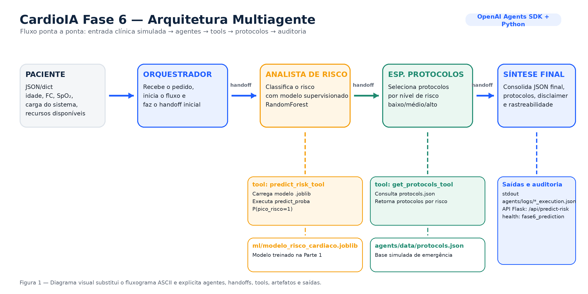
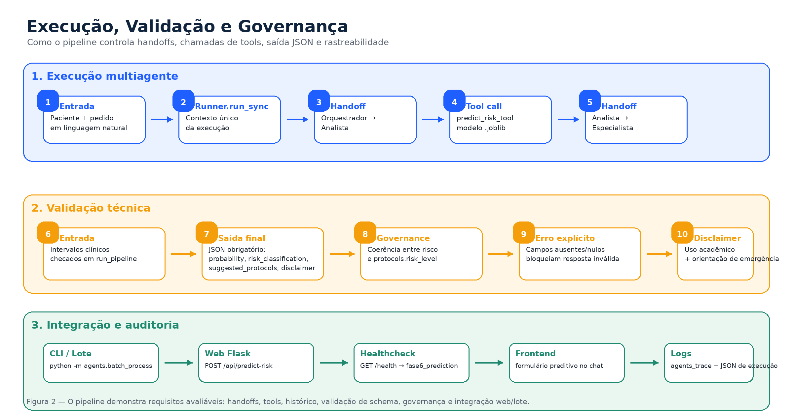
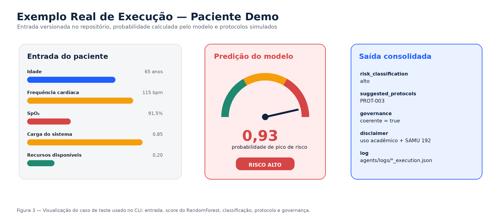

# CardioIA Fase 6 — Arquitetura do Sistema Multiagente (documento para PDF)

**FIAP · 2TIAOR20242** · Parte 2 — máx. 3 páginas ao exportar · **Fonte Markdown oficial:** este arquivo

**Equipe:** Alexandre Mantovani · Edmar Souza · Ricardo Coube · Jose Andre Filho

---

## 1. Diagrama simplificado da arquitetura

```
  PACIENTE (JSON/dict)
  idade, freq_cardiaca, spo2, carga_sistema, disponibilidade_recursos
                              │
                              ▼
                    ┌─────────────────┐
                    │  ORQUESTRADOR   │  Runner.run_sync + handoff inicial
                    └────────┬────────┘
                             │ handoff
                             ▼
                    ┌─────────────────┐     tool: predict_risk_tool
                    │ ANALISTA RISCO  │────► ml/modelo_risco_cardiaco.joblib
                    └────────┬────────┘      (RandomForest, P(pico_risco=1))
                             │ handoff
                             ▼
                    ┌─────────────────┐     tool: get_protocols_tool
                    │ ESP. PROTOCOLOS │────► agents/data/protocols.json
                    └────────┬────────┘
                             │ handoff
                             ▼
                    ┌─────────────────┐
                    │  ORQUESTRADOR   │  JSON final + disclaimer
                    └────────┬────────┘
                             ▼
              stdout + agents/logs/*_execution.json
```

**Figura 1 — Arquitetura visual do CardioIA Fase 6**



---

## 2. Papel de cada agente

| Agente | Papel | Tools | Handoff |
|--------|--------|-------|---------|
| **Orquestrador** | Recebe o pedido em linguagem natural, inicia o fluxo, consolida a **resposta final** com probabilidade, classificação, protocolos e **disclaimer** obrigatório. | Nenhuma | → Analista de Risco |
| **Analista de Risco** | Executa a **predição de pico de risco** com o modelo supervisionado treinado na Parte 1; devolve probabilidade e faixa (baixo/médio/alto). | `predict_risk_tool` | → Especialista em Protocolos |
| **Especialista em Protocolos** | Mapeia a classificação de risco à **base simulada** de protocolos de emergência. | `get_protocols_tool` | → Orquestrador (encerramento / síntese) |

---

## 3. Handoffs, tools, histórico e validação

**Handoffs:** no OpenAI Agents SDK, `handoff(destino)` transfere o controle entre agentes mantendo o **contexto da conversa** na mesma execução de `Runner.run_sync`. O encadeamento implementado em `agents/personas/` + `agents/pipeline/llm_pipeline.py` é: Orquestrador → Analista → Especialista → retorno ao fluxo para síntese final.

**Tools:** funções Python expostas ao modelo via `@function_tool`. O Analista chama `predict_risk_tool` (carrega `.joblib`, `predict_proba` classe 1 = probabilidade de `pico_risco`). O Especialista chama `get_protocols_tool` (lê `protocols.json` por chave `baixo` / `médio` / `alto`).

**Histórico de mensagens:** o `Runner` gerencia internamente as mensagens do diálogo (usuário, assistente, tool calls e resultados) ao longo dos handoffs; o repositório persiste um **log JSON** (`patient_input`, `final_recommendation`, `agents_trace`) para auditoria acadêmica.

**Validação de saída:** após o texto final, o código exige JSON com chaves `probability`, `risk_classification`, `suggested_protocols` e `disclaimer`; campos ausentes ou nulos geram erro explícito. A entrada do paciente é validada por intervalos em `run_pipeline`. É acrescentado **`governance`** (coerência entre `risk_classification` e `risk_level` dos protocolos — IR ALÉM 1).

**Integração web (mesmo produto):** `POST /api/predict-risk` no Flask chama o mesmo pipeline; `GET /health` expõe `fase6_prediction` (ficheiros modelo/protocolos e SDK). A interface de chat (`frontend/`) exibe um **formulário preditivo embutido** na própria conversa: após a orientação educacional da Fase 5, o usuário preenche os 5 campos clínicos diretamente no chat e recebe a recomendação multiagente sem sair da página — Fase 5 e Fase 6 no mesmo produto. Lote: `python -m agents.batch_process` (IR ALÉM 2).

**Figura 2 — Fluxo de execução, validação e governança**



---

## 4. Exemplo real de entrada e saída (dados + modelo no repositório)

**Entrada (mesmo dicionário que `PACIENTE_DEMO` em `agents/main.py`, usado pelo CLI):**

```json
{"idade":65,"freq_cardiaca":115,"spo2":91.5,"carga_sistema":0.85,"disponibilidade_recursos":0.2}
```

**Saída determinística do modelo e da base de protocolos** (executado localmente com o `.joblib` versionado; a camada LLM formata o JSON final):

- `probability`: **0.93** (93% de probabilidade de pico de risco, classe positiva do modelo binário).
- `risk_classification`: **alto**.
- `suggested_protocols`: lista retornada por `get_protocols_tool("alto")` (ex.: protocolo **PROT-003** — emergência cardíaca simulada).
- `disclaimer`: texto fixo de uso acadêmico e encaminhamento a serviço de emergência (SAMU 192), conforme `agents/config.py`.

**Trecho de log persistido** (`agents/logs/<timestamp>_<id>_execution.json`):

```json
{
  "patient_input": {"idade": 65, "freq_cardiaca": 115, "spo2": 91.5, "carga_sistema": 0.85, "disponibilidade_recursos": 0.2},
  "final_recommendation": {"probability": 0.93, "risk_classification": "alto"},
  "governance": {"coerente": true}
}
```

O log completo inclui ainda `timestamp`, `suggested_protocols`, `disclaimer` e `agents_trace`, preservando rastreabilidade da execução ponta a ponta.

**Figura 3 — Exemplo de execução do paciente demo**



---

*Exportar para PDF: VS Code “Markdown PDF”, Pandoc, ou impressão do preview do GitHub — ajustar margens e fonte (ex. 10–11 pt) para caber em **três páginas**.*
